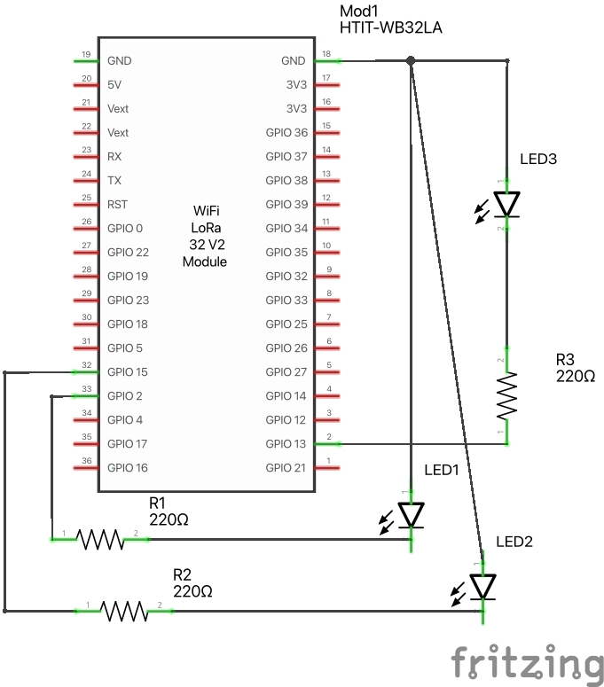
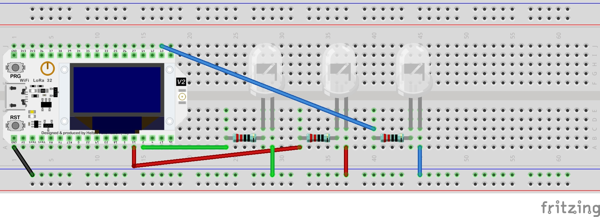
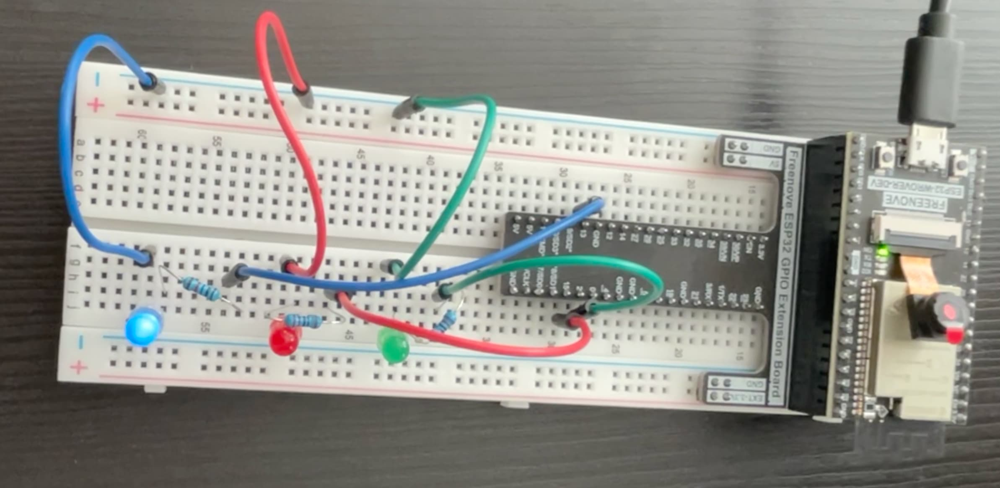
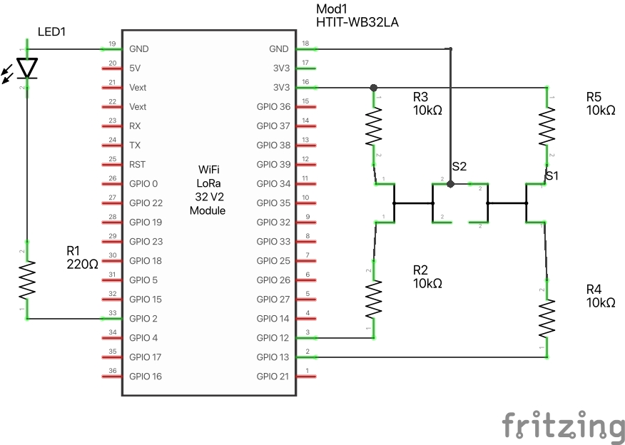
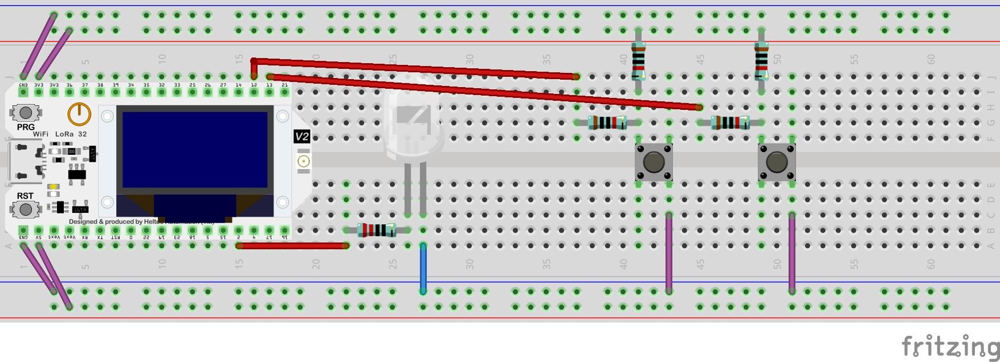
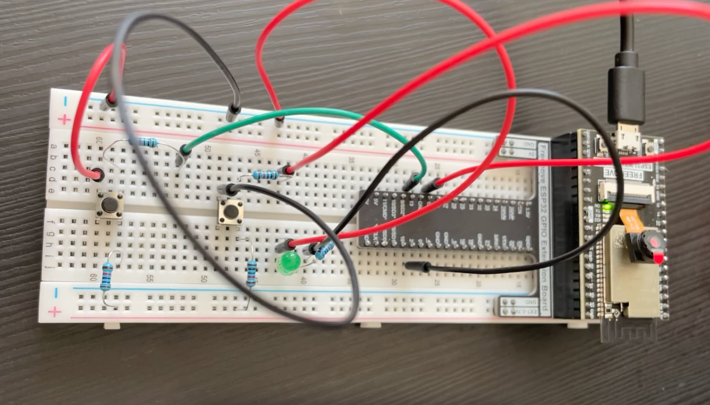

# Physical Computing - LEDs and Push Buttons

In this laboratory, we will do simple circuits where we get more familiar with ESP32 and using C++.

## Project 1 - Three LEDs

Date: 09/16/23

Description: Design and construct a circuit that includes three LEDs (red, green, and blue). When your program
runs, each LED turns on and off (blinks) sequentially and continually (red → green → blue → red → green → blue → …). Capture your settings and working circuit in photos and videos.
Parts:

- Jumper M/M x6
- 1 Green LED
- 1 Red LED
- 1 Blue LED
- Resistor 220Ω x3

## Project 2 - Two push buttons and an LED

Date: 09/16/23

Description: Design and construct a circuit that includes two push buttons and an LED. When one button is pushed, the LED is on while the other button is pushed, the LED is off. When the same button is pushed multiple times, it should not change the status of the LED. Capture your settings and working circuit in photos and videos.

Parts:

- Jumper M/M x6
- 1 Green LED
- 1 Two push buttons
- Resistor 220Ω x1
- Resistor 10kΩ x4

